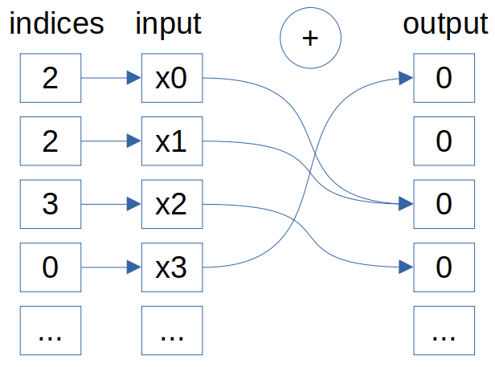
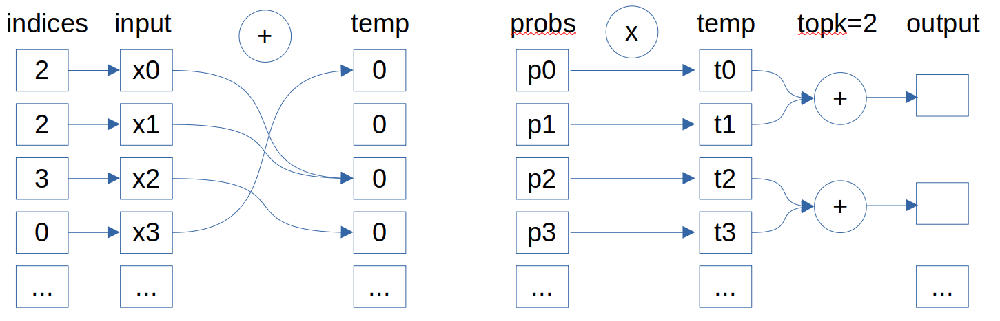
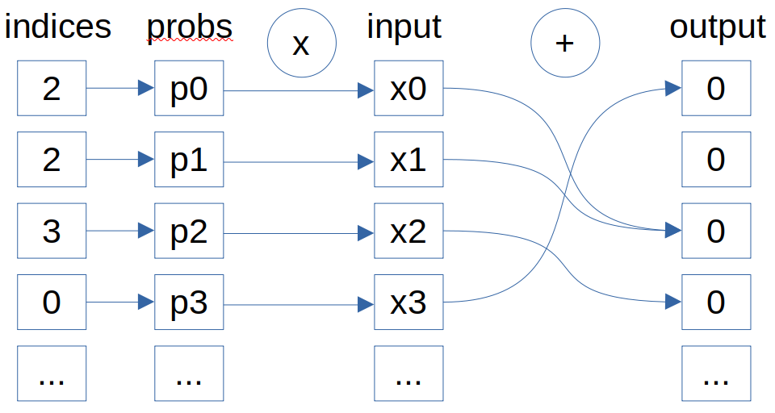

# moe_unpermute 实现设计方案

* #### 文档基本信息
| 算子名称 | moe_unpermute |
| ------ | ------------ |
| 编制人/日期 | 陈其阳/2025-1-13 |

* #### 修改记录
| 版本号 | 修订人  | 修订日期   | 修订描述 |
| ----- | ------ | -------   | ------- |
| V 1.0 | 陈其阳  | 2025-1-13 | 首次提交 |
| V 2.0 | 陈其阳  | 2025-4-28 | v2.0 接口，针对"索引唯一"情况做性能优化 |
| V 2.1 | 陈其阳  | 2025-5-26 | 补充,moe_unpermute 作为 moe_permute 的反向算子的说明 |

* #### 内容描述
moe 模块主要分为四个步骤：router、token_permutation、experts computation、token_unpermutation。
本文档为 " moe 模块的 token_unpermutation 步骤中的 local unpermute 功能实现和 local permute 功能模块的反向算子"
的设计文档，包括需求分析、接口设计、方案设计、性能优化记录。

## 1 需求分析

### 1.1 算子需求分析
| 算子功能简介 | moe 模块的 token_unpermutation 步骤中的 local unpermute 功能模块的融合，和 local permute 功能模块的反向算子 |
|-------------|--------------------------------------------------------------|
| 需求来源    | PJ_LAB |
| 应用网络    | 浦语3 |
| 输入数据类型 | 非索引数据：half, float, bfloat16。索引数据：int64_t |
| 输入Shape   | 见[算子shape展开说明](#111-算子shape展开说明) |
| 输入Layout  | ARRAY |
| 输出数据类型 | half, float, bfloat16 |
| 输出Shape   | 见[算子shape展开说明](#111-算子shape展开说明) |
| 输出Layout  | ARRAY |
| 是否含有dim/axis等类似语义的参数且该参数支持负数/其他特殊处理 | 否 |
| 是否含有labels/index等类似语义的参数且该参数支持负数/界外情况/其他特殊处理 | 否|
| 是否需要支持原位        | 否       |
| 是否需要支持stride机制  | 否       |
| 是否需要支持广播        | 否       |
| 0元素检查是否直接返回    | 否       |

#### 1.1.1 算子shape展开说明

上层传参说明：
- total_seq = mbs * seqlen * topk * t, mbs 是 micro_batch_size；t = [0.9, 1) 大概这个范围
- cap = ceil((seqlen * topk/expert_num) * cap_factor)

unpermute 作为前向算子时
| 模式 | permuted_tokens | indices | probs | indices 是否唯一 | unpermuted_tokens |
|-----|-----------------|---------|-------|-----------------|------------------|
| unpermute Allgather(unpad) | [total_seq, H] | [total_seq] | - | 唯一 | [total_seq, H] |
| unpermute AlltoAll(默认,unpad) | [seqlen * topk, H] | [seqlen * topk] | [seqlen, topk] | 唯一 | [seqlen, H] |
| unpermute AlltoAll方法(cap_factor=1.0,unpad) | [total_seq, H] | [total_seq] | [seqlen, topk] | 唯一 | [seqlen, H] |
| unpermute AlltoAll方法(cap_factor=1.0,pad) | [expert_num * cap, H] | [expert_num, cap] | [expert_num, cap] | 不唯一 | [seqlen, H] |

unpermute 作为反向算子时
| 模式 | permuted_tokens | indices | probs | indices 是否唯一 | unpermuted_tokens |
|-----|-----------------|---------|-------|-----------------|------------------|
| permute_backward Allgather(unpad) | [total_seq, H] | [total_seq] | - | 唯一 | [total_seq, H] |
| permute_backward AlltoAll、alltoall_seq方法(unpad) | [seqlen * topk, H] | [seqlen * topk] | - | 不唯一 | [seqlen, H] |
| permute_backward AlltoAll方法(cap_factor=1.0,pad) | [expert_num * cap, H] | [expert_num, cap]	| - | 不唯一 | 	[seqlen * topk, H]

注：
- 算子层面不感知 mbs, t, cap_factor，这三个参数只在上层用于计算 total_seq 或 cap
- 第三个模式, total_seq <= seqlen * topk，如果取=号，第三个模式就是第二个模式。

记 pad 模式为 padded_mode。<br>
观察多种模式的shape特点：
- permuted_tokens 高维度数量与 indices 的总数量一定相等, 可以用一个参数 permuted_total_tokens 表示。<br>
  注：unpermute 和 permute_backward 最核心的操作是离散访存，索引映射关系是这个算子的重点。
- permuted_tokens 低纬度数量与 unpermuted_tokens 的低维度数量一定相等，可以用一个参数 hidden 表示。
- unpad 模式下，topk 必须指定，需要用一个参数 topk 表示。（在小算子逻辑中，topk 参数与 临时tensor 的累加计算相关）<br>
  unpermute 算子中， unpad 模式且 probs 不为空时的 topk 等于 probs 的低维度数量，其余情况下不使能（默认为1）。<br>
  permute_backward 算子中，unpad 模式的 topk 需要上层显示给出，其余情况下不使能（默认为1）。
- unpermuted_tokens 高维度数量乘以 topk 与 permuted_tokens 高维度数量不一定相等，<br>
  unpermuted_tokens 高维度数量需要用一个参数 unpermuted_total_tokens 表示。

### 1.2 算子功能和应用场景描述

MOE 模块主要分为四个步骤：
- router：路由器对每个token计算专家分配分数，并通过 Softmax 选出 top‑k 个专家及其概率
- token_permutation：根据路由分配，对token特征进行重新排列，将分配给同一专家的token聚集到一起，通常需要计算掩码并进行前缀和操作以生成排列索引
- experts computation：对分组后的tokens在各自专家上并行执行前馈网络或其他算子，常见做法是使用 batched GEMM 或 block‑sparse 矩阵乘法
- token_unpermutation：将专家输出逆向重排回原始token顺序，并按路由概率对多个专家输出加权求和，得到最终的 MoE 层输出

token_unpermutation 中的主要步骤：
- shape 变换
- local unpermute, 概率缩放（moe_unpermute 算子功能）
- EP，TP 的规约

token_unpermutation 有多种模式，多种模式下的 moe_unpermute 的实现细节有所区别，<br>
可分为：allgather 分支，all2all(unpad) 分支，all2all(pad)分支。<br>

#### 1.2.1 unpermute allgather 分支和 permute_backward 下的等价逻辑
此时 probs 一定为 nullptr

公式：
$$
刷0: \forall {i,j},\quad \text{y}_{i,j} = 0 \\[1.5ex]
令 k = {\text{index}_i} \\[1.5ex]
\forall {i,j},\quad \text{y}_{k/topk,j} \mathrel{+}= \text{x}_{i,j}
$$

竞品伪代码：
```python
y.zero_()
for i in range(total_seq):
    k = indices[i] // topk
    y[k] += x[i]
```

示意图（topk=1）为：


注：
- indices 唯一且输入与输出的tokens数量相同时，unpermuted_tokens[indices[i], :] = permuted_tokens[i, :]

#### 1.2.2 unpermute all2all(unpad) 分支下的等价逻辑
permuted_tokens:[seqlen * topk, H], indices:[seqlen * topk], probs:[seqlen, topk], unpermuted_tokens:[seqlen, H] <br>
permuted_tokens:[total_seq, H], indices:[total_seq], probs:[seqlen, topk], unpermuted_tokens:[seqlen, H] <br>

公式：
$$
\forall {i,j},\quad \text{t}_{i,j} = 0 \\[1.5ex]
令 k = {\text{index}_i} \\[1.5ex]
\forall {i,j},\quad \text{t}_{k,j} \mathrel{+}= \text{x}_{i,j} \\[1.5ex]
\forall {i,j},\quad \text{y}_{i/topk,j} \mathrel{+}= \text{t}_{i,j} * p_i
$$
简化得
$$
\forall {i,j},\quad \text{y}_{i,j} = 0 \\[1.5ex]
令 k = {\text{index}_i} \\[1.5ex]
\forall {i,j},\quad \text{y}_{k/topk,j} \mathrel{+}= \text{x}_{i,j} * p_k
$$

竞品伪代码：
```python
temp.zero_()
for i in range(seqlen * topk):
    temp[indices[i]] += x[i]

temp = temp.reshape(seqlen, topk, H)
temp *= probs.unsqueeze(-1)
y = temp.sum(dim=1)
```

示意图为：


注：
- probs 的索引是与 unpermuted_tokens 的索引对应。
- indices 唯一时，第二步等价于 temp[indices[i], :] = permuted_tokens[i, :]

#### 1.2.3 unpermute all2all(pad) 分支下的等价逻辑
permuted_tokens:[expert_num * cap, H], indices:[expert_num, cap], probs:[expert_num, cap], unpermuted_tokens:[seqlen, H] <br>

公式：
$$
刷0: \forall {i,j},\quad \text{y}_{i,j} = 0 \\[1.5ex]
令 k = {\text{index}_i} \\[1.5ex]
\forall {i,j},\quad \text{y}_{k,j} \mathrel{+}= \text{x}_{i,j} * p_i
$$

竞品伪代码：
```python
y.zero_()
probs = probs.reshape(-1, 1)
for i in range(expert_num * cap):
    y[indices[i]] += x[i] * probs[i]
```

示意图为：


注：
- probs 的索引是与 permuted_tokens 的索引对应。
- indices 唯一时，第三步等价于 unpermuted_tokens[index[i],:] = permuted_tokens[i, :] * probs[i, :]
- 虽然 pad 模式上层传参时 index 是可能重复的，但 unique 情形下的 pad 分支容易实现，也做了相关优化。


### 1.3 算子输入输出参数要求
| 参数          | 语义 | 类型（输入/输出） | 支持类型    | 物理布局 | 规模限制 |
| ------------- | ---- | ----------------- | ----------- | -------- | -------- |
| queue        | CNRT 队列，保存运行的上下文信息     | 输入              | /          | /        | 无       |
| permuted_tokens | 输入数据，指向输入词向量的mlu首地址 | 输入 | half, float, bfloat16 | ARRAY | 见[算子shape展开说明](#111-算子shape展开说明)  |
| indices | 输入数据，指向索引数据的mlu首地址 | 输入 | int64 | ARRAY |  同上  |
| probs | 输入数据，指向probs数据的mlu首地址 | 输入 | half, float, bfloat16 | ARRAY | 同上 |
| unpermuted_tokens | 输出数据，指向输出词向量的mlu首地址 | 输出 | half, float, bfloat16 | ARRAY | 同上 |
| padded_mode | 参数，pad 模式 | 输入 | bool | / | 无 |
| permuted_total_tokens | 参数，permuted_tokens 第一维数量 | 输入 | size_t | / | 无 |
| hidden | 参数，permuted_tokens 第二维数量 | 输入 | size_t | / | 无 |
| topk | 参数，unpermute算子中，padded_mode 为 false 且 probs 不为空时，topk为 probs 第二维数量，否则为 1；permute_backward 算子中，由上层指定 | 输入 | int | / | 无 |
| unpermuted_total_tokens | 参数，unpermuted_tokens 第一维数量 | 输出 | size_t | / | 无 |
| algo | 算法描述参数，现有描述 index 是否唯一的字段 | 输入 | / | / | 无 |

注: 由于 permute_backward 算子中 topk 无法根据 shape 关系推导，而V2.0以前是根据 shape 关系推导获取 topk，为了兼容性考虑：<br>
proto 中新增 topk 参数，如果 topk 参数为 0，则 topk 重新由 shape 推导。

### 1.4 算子限制
- 本身有 nan/inf 的得对齐，如果计算溢出造成的 nan/inf 这种可以不对齐。
- sorted_indices 中元素值范围为 [0, topk*unpermuted_total_tokens - 1]。
- 累加次数过多（即 indices 数据中有大量重复的值）时，精度可能无法对齐。<br>
  注：累加次数过多时，静态阈值可能通不过，尤其是bfloat16类型。

### 1.5 验收标准

#### 1.5.1 精度验收标准

- 采用动态阈值：
  diff=[diff1, diff2, diff4], threshold_rate=[10, 10, 1]。
- largeTensor, 或含有 nan/inf 时，使用静态阈值：<br>
  diff=[diff1, diff2], threshold=[3e-3, 3e-3]。


## 2 算子接口设计

### 2.1 参考接口
permute和unpermute的算子融合：https://github.com/fanshiqing/grouped_gemm/blob/main/csrc/permute.cu <br>
算子功能参考：http://gitlab.software.cambricon.com/neuware/oss/nvidia/Megatron-LM/-/blob/core_r0.9.0_mlu/megatron/core/transformer/moe/moe_utils.py <br>

cuda融合算子
```python
  def unpermute(
    permuted_tokens: torch.Tensor,
    sorted_indices: torch.Tensor,
    probs: torch.Tensor = None,
    padded_mode: bool = False,
    restore_shape: torch.Size = None,
  ):
```

### 2.2 接口设计
```c++
struct moeUnpermuteAlgo {
  bool is_unique = false;
};

bangcKernelsStatus_t BANGC_KERNELS_WIN_API mluGetMoeUnpermuteWorkspaceSize(
    const cnnlHandle_t handle, const bool has_probs, const bool padded_mode,
    const uint32_t data_size, const size_t permuted_total_tokens,
    const size_t hidden, const int topk, const size_t unpermuted_total_tokens,
    const moeUnpermuteAlgo algo, size_t *workspace_size);

template <typename T>
bangcKernelsStatus_t BANGC_KERNELS_WIN_API mluMoeUnpermute_v2(
    const cnnlHandle_t handle, const T *permuted_tokens,
    const int64_t *sorted_indices, const T *probs, T *unpermuted_tokens,
    void *workspace, const bool padded_mode, const size_t permuted_total_tokens,
    const size_t hidden, const int topk, const size_t unpermuted_total_tokens,
    const moeUnpermuteAlgo algo);
```

## 3 实现方案设计

### 3.1 实现方案

性能优化主要围绕两个点展开：
- 省略刷 0 过程。
- __memcpy 替换 __bang_atomic_reduce_add 指令。

#### 3.1.1 no_probs 分支（unpermute算子的allgather 和 permute_backward算子）
(1) 索引不唯一时的实现方案
a.单独起kernel，output 刷 0。<br>
b.主逻辑:
- 按顺序 load permuted_tokens([seg_tokens, seg_hidden]), indices([seg_tokens])。
- 将计算结果 __bang_atomic_reduce_add 累加到 offset/topk 偏移后的输出上。

(2) 索引唯一时的优化方案
a.刷 0 逻辑。<br>
- element_wise 的情况（permuted_total_tokens == topk * unpermuted_total_tokens）, 不刷0。
- 仅 unique 非 element_wise 的情况（permuted_total_tokens < topk * unpermuted_total_tokens），单独起kernel，output 刷 0。
b.主逻辑：
- 按顺序 load permuted_tokens([seg_tokens, seg_hidden]), indices([seg_tokens])。
- 如果 topk == 1，将计算结果 memcpy 拷贝到 offset/topk 偏移后的输出上；<br>
  如果 topk > 1，将计算结果 __bang_atomic_reduce_add 累加到 offset/topk 偏移后的输出上。

#### 3.1.2 pad 分支 (unpermute算子)
(1) 索引不唯一时的实现方案
a.单独起kernel，output 刷 0。<br>
b.主逻辑:
- 按顺序 load permuted_tokens([seg_tokens, seg_hidden]), indices([seg_tokens])。
- 按顺序 load probs([seg_tokens])。
- seg_tokens 维度 for 循环遍历，计算 permuted_tokens * probs。
- 将计算结果 __bang_atomic_reduce_add 累加到 offset 偏移后的输出上。

(2) 索引唯一时的优化方案
索引唯一时，pad 分支不存在累加情况，可以用 memcpy 替换 __bang_atomic_reduce_add。<br>
如果 permuted_total_tokens == unpermuted_total_tokens, 此时输入索引和输出索引可以建立一一映射关系（element_wise情形），可以省去 output 刷 0 的过程。

核心优化点：memcpy 替换 __bang_atomic_reduce_add，element_wise情形省去 output 刷 0。

#### 3.1.3 unpad 分支 (unpermute算子)
(1) 索引不唯一时的实现方案
a.单独起kernel，output 刷 0。<br>
b.主逻辑:
- 按顺序 load permuted_tokens([seg_tokens, seg_hidden]), indices([seg_tokens])。
- 根据 indices gather probs([seg_tokens])。
- seg_tokens 维度 for 循环遍历，计算 permuted_tokens * probs。
- 将计算结果 __bang_atomic_reduce_add 累加到 offset/topk 偏移后的输出上。

(2) 索引唯一时的优化方案
索引唯一时，还是有逐 topk 行的累加(虽然topk=1时没有累加，但网络场景的topk一般大于 1,在性能优化时不单独对topk=1做优化)，无法直接用 memcpy 替换 __bang_atomic_reduce_add。<br>
优化思路：将累加放在 NRAM 上完成，那么 permuted_tokens 需要与 output 的索引一一对应起来。<br>

a. element_wise 的情况（permuted_total_tokens == topk * unpermuted_total_tokens）
- 单独起kernel, 将inorder数据(0,1,2...n) 按 indices scatter 到 workspace 中（实际按offset去写出，方便直接gather），记为 indices_s。
- permuted_tokens 按 indices_s gather 到 NRAM 上，permuted_tokens 和 output 的索引可以一一对应起来。

b. 仅 unique 非 element_wise 的情况（permuted_total_tokens < topk * unpermuted_total_tokens）
- 单独起kernel, indices_s 刷 -1，表示无效区域。
- 单独起kernel, 将inorder数据(0,1,2...n) 按 indices scatter 到 workspace 中（实际按offset去写出，方便直接gather），记为 indices_s。
- 单独起kernel, indices_s >= 0 判断得到 mask。(mask 是 bit 型数据，必须按8位对齐)。
- nram_permuted_tokens 先 memset 刷0。
- permuted_tokens 再按 indices_s 和 mask gather 到 NRAM 上，permuted_tokens 和 output 的索引可以一一对应起来。

在NRAM上，permuted_tokens 需要与 output 的索引一一对应起来后。<br>
for 循环遍历，计算 permuted_tokens * probs。<br>
然后 __bang_sumpool 逐 topk 行做累加（topk = 1时，跳过该步）。<br>
累加结果通过 memcpy 拷贝到 output 中。

注：
- 需要申请 indices_s，mask 的 workspace 空间。
- topk 不能太大，否则片上空间不足或者hidden维度拆分过细碎，难以有好的性能优化效果。目前在384*1024的NRAM空间上,topk<=256时才会进入优化分支。

核心优化点：片上做累加，省去 output 刷 0。

#### 3.1.3 流水方案

permuted_tokens * probs 是按 for 循环做的，有大量的标量指令。流水时，需要将 compute 放在 IO 后面，才能取得较好的性能效果。

(1) no_probs 分支空间划分
| permuted_tokens | indices |
|-----------------|---------|
| T               | int64_t |
| tokens * hidden | tokens  |

(2) pad 分支和 unpad 默认分支空间划分
| permuted_tokens | probs  | indices |
|-----------------|--------|---------|
| T               | T      | int64_t |
| tokens * hidden | tokens | tokens  |

(3) unpad element_wise 分支空间划分
| permuted_tokens | probs  | indices_s  | output                 |
|-----------------|--------|------------|------------------------|
| T               | T      | int64_t    | T                      |
| tokens * hidden | tokens | tokens     | tokens / topk * hidden |

(4) unpad unique 分支空间划分
| permuted_tokens | probs  | indices_s  | mask                | output |
|-----------------|--------|------------|---------------------|--------|
| T               | T      | int64_t    | int8_t              | T      |
| tokens * hidden | tokens | tokens | CEIL(tokens/8) | tokens/topk*hidden |

### 3.2 伪代码实现

默认方案伪代码
```c++
  // 计算单次处理的 seg_tokens, seg_hidden, tokens_offset, hidden_offset

  // load
  __memcpy(nram_permuted_tokens, ...);
  __memcpy(nram_indices, ...);

  if (has_probs) {
    if (padded_mode) {
      __memcpy(nram_probs, ...);
    } else {
      __gather(nram_probs, nram_indices, ...);
    }
  }

  // compute
  for (int i = 0; i < seg_tokens; ++i) {
    __bang_mul_scalar(nram_permuted_tokens + i * seg_hidden, nram_permuted_tokens + i * seg_hidden, nram_probs + i, seg_hidden);
  }

  // store
  for (int i = 0; i < seg_tokens; ++i) {
    int64_t offset = __load_nram(indices + i);
    __bang_atomic_reduce_add(unpermuted_tokens + offset * hidden + hidden_offset,
                             input_c + i * seg_hidden, seg_hidden);
    // index 唯一时
    __memcpy(unpermuted_tokens + offset * hidden + hidden_offset,
             input_c + i * seg_hidden, seg_hidden, ...);
  }
```

额外调用 kernel 的逻辑，都可视作1d数据处理
```c++
// 刷值
__bang_write_value
__memcpy

// indices scatter 得到 indices_s
__bang_incseq 构造一个自增序列 nram_order_cache(作为缓存值，以免重复调用)
nram_order_cache 再根据偏移和 hidden_size 计算得 nram_order
__scatter(indices_s, nram_order, nram_indices, ...);

// get mask
mtp_592 指令限制，需要四个指令完成mask的计算
__bang_ge_scalar
__bang_int642int32
__bang_int322float
eq.scalar.bitindex.nram.f32
```

流水实现
```c++
  // pipeline3
  if (repeat > 0) {
    _LOAD(0)
    PINGPONGSWAP
    __sync();
  }
  if (repeat > 1) {
    _LOAD(1)
    _COMPUTE(0)
    PINGPONGSWAP
    __sync();
  }
  for (size_t i = 2; i < repeat; ++i) {
    _STORE(i - 2)
    _LOAD(i)
    // _COMPUTE 中有大量标量运算，放在IO后面有较好的性能
    _COMPUTE(i - 1)
    PINGPONGSWAP
    __sync();
  }
  if (repeat > 1) {
    _STORE(repeat - 2)
  }
  if (repeat > 0) {
    _COMPUTE(repeat - 1)
  }
  PINGPONGSWAP
  __sync();
  if (repeat > 0) {
    _STORE(repeat - 1)
  }
```

unpad 的 element_wise 分支
```c++
// 计算单次处理的 seg_tokens, seg_hidden, tokens_offset, hidden_offset

// _Load
__memcpy_async(ping_indices_s, indices_s + tokens_offset, ...);
__memcpy_async(ping_probs, probs + tokens_offset, ...);
__gather_async((T *)ping_permuted_tokens, permuted_tokens + hidden_offset, ping_indices_s, ...);

// _COMPUTE
for (int i = 0; i < seg_tokens; ++i) {
  __bang_mul_scalar(nram_permuted_tokens + i * seg_hidden, nram_permuted_tokens + i * seg_hidden, nram_probs + i, seg_hidden);
}

if (topk > 1) {
  __bang_sumpool((T *)pong_output, (T *)pong_permuted_tokens, seg_hidden, 1,
                  seg_tokens, 1, topk);
}

// _STORE __memcpy2d，用IO双流优化性能
```

unpad 的 unique 分支
```c++
// 计算单次处理的 seg_tokens, seg_hidden, tokens_offset, hidden_offset

// _Load
__memcpy_async(ping_indices_s, indices_s + tokens_offset, ...);
__memcpy_async(ping_probs, probs + tokens_offset, ...);
__memcpy_async(ping_mask, mask + tokens_offset / 8, CEIL_DIV(seg_tokens, 8), GDRAM2NRAM);
__memset_nram_async((T *)ping_permuted_tokens, seg_tokens * seg_hidden, (T)0);
__gather_async((T *)ping_permuted_tokens, permuted_tokens + hidden_offset, ping_indices_s, ping_mask, ...);

// _COMPUTE
for (int i = 0; i < seg_tokens; ++i) {
  __bang_mul_scalar(nram_permuted_tokens + i * seg_hidden, nram_permuted_tokens + i * seg_hidden, nram_probs + i, seg_hidden);
}

if (topk > 1) {
  __bang_sumpool((T *)pong_output, (T *)pong_permuted_tokens, seg_hidden, 1,
                  seg_tokens, 1, topk);
}

// _STORE __memcpy2d，用IO双流优化性能
```

### 3.3 拆分

#### 3.3.1 核间拆分
二维拆分，大的长方形被拆分成 core_num 个小长方形。<br>
沿高维度（tokens 维度）方向拆分的小长方形数量记为 tokens_part，<br>
沿低维度（hidden 维度）方向拆分的小长方形数量记为 hidden_part。<br>

每个IPU处理的数据块对应一个小长方形，要使得负载尽可能均衡，需要满足 tokens_part * hidden_part = core_num。<br>
也就是说 tokens_part 与 hidden_part 都为 core_num 的因数。<br>

core_num 的因数集合为 Q, 例如： core_num = 32 时， Q = {1,2,4,8,16,32}<br>

默认 tokens_part = core_num, hidden_part = 1。（即默认只做 tokens 维度的拆分）<br>
当 core_num > permuted_total_tokens （tokens 维度本身数量太少）时，也去拆分 hidden 维度。<br>
从 Q 中选取小于 permuted_total_tokens 的最大因数， 这个因数作为 tokens_part。<br>
确定 tokens_part 后，hidden_part = core_num / tokens_part。

#### 3.3.2 核内拆分
(1)no_probs 分支、pad 分支、unpad 的默认分支<br>
tokens 维度平均拆分，hidden 维度按512B对齐拆分。

(2)有probs 且 为unpad模式 的 element_wise 分支<br>
tokens 维度按 topk 对齐拆分，hidden 维度按512B对齐拆分。<br>
在计算过程中, seg_tokens 必须是 topk 的倍数。

(3)有probs 且 为unpad模式 的 unique 分支<br>
记 topk 与 8 的最小公倍数是 align_num。<br>
tokens 维度按 align_num 对齐拆分，hidden 维度按512B对齐拆分。<br>
在计算过程中, seg_tokens 必须是 align_num 的倍数。


### 3.4 算子防呆说明

- 指针限制:
  - probs可为空，其余输入和输出指针均不能为空。
- 数据类型限制:
  - permuted_tokens、probs（不为空时）、unpermuted_tokens 的 dtype 相同，可为 half/float/bfloat16。bfloat16 在mtp_592以上板卡支持。
  - sorted_indices 的 dtype 为 int64。
- shape限制：见[算子shape展开说明](#111-算子shape展开说明)
- 真值限制：
  - sorted_indices 中元素值范围为 [0, topk*unpermuted_total_tokens-1]。

## 4 算子性能/精度问题 & 优化记录

### 4.1 当前存在问题的规模说明

- hidden 较小时性能差。网络中 hidden 为2048，性能不会有影响。

### 4.2 已经过优化的规模说明
- 针对索引数据唯一的情况做过性能优化，索引数据唯一时间减少约40%。
